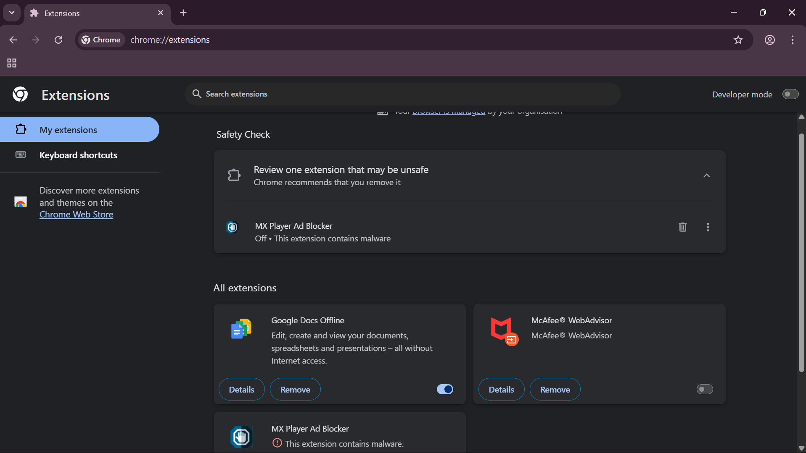
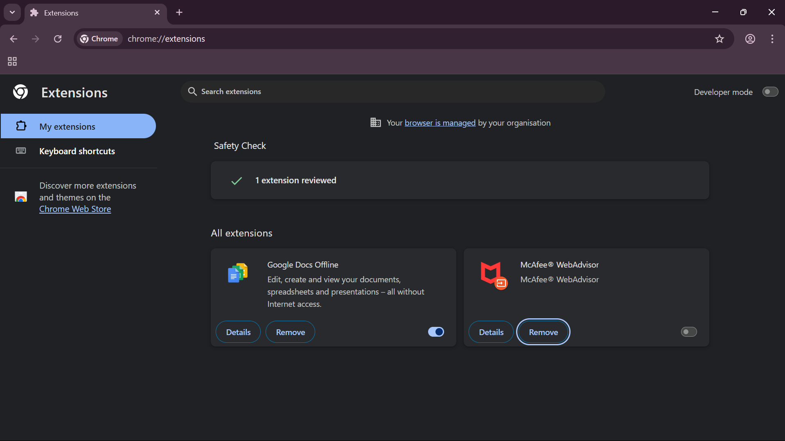

# 🛡️ Task 7 – Browser Security: Identifying & Removing Suspicious Extensions

> Identified and removed a malware-flagged Chrome extension as part of a cybersecurity internship task, demonstrating secure extension management and browser auditing practices.

---

## 📌 Overview

This task, completed during a cybersecurity internship, focused on auditing browser extensions to detect and remove potentially risky or unnecessary ones. It reinforced secure browsing habits and awareness of how malicious extensions can impact user privacy and system integrity.

---

## 🎯 Objective

- Review all installed browser extensions
- Identify extensions flagged by Chrome or with suspicious permissions
- Remove unsafe or unnecessary extensions
- Document the findings with before-and-after screenshots

---

## 🔍 Extension Review Summary

| Extension Name            | Status     | Action Taken        | Notes                                                  |
|---------------------------|------------|----------------------|---------------------------------------------------------|
| Google Docs Offline       | ✅ Safe    | Retained             | Trusted extension by Google                            |
| McAfee WebAdvisor         | ✅ Safe    | Disabled (optional)  | Safe but not essential for daily use                   |
| MX Player Ad Blocker      | ❌ Malware | Removed              | Flagged by Chrome as containing malware                |

---

## 🧭 Steps Performed

1. Accessed the Chrome extension manager via [chrome://extensions/](chrome://extensions/)
2. Reviewed installed extensions, their sources, and permissions
3. Chrome displayed a malware warning on **MX Player Ad Blocker**
4. Immediately removed the flagged extension
5. Restarted the browser to ensure cleanup
6. Took screenshots before and after the removal for documentation

---

## 📸 Screenshots

### 🔴 Before Removal  
> Chrome flagged **MX Player Ad Blocker** as containing malware:  

### ✅ After Removal  
> The flagged extension was successfully removed:  

---

## 🔐 Key Learnings

- Extensions should be regularly reviewed for suspicious behavior
- Permissions like "read and change all your data on all websites" are red flags
- Chrome’s built-in malware detection is a helpful security layer
- Removing unused or unknown extensions improves browser security
- Awareness of privacy risks associated with third-party add-ons is critical

---

## 🗂️ Repository Structure

